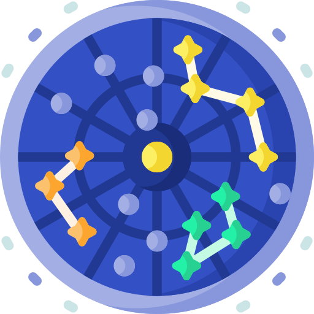

![Status](https://img.shields.io/badge/status-active-brightgreen?style=flat-square&logo=data:image/png;base64,iVBORw0KGgoAAAANSUhEUgAAADAAAAAwCAYAAABXAvmHAAAABmJLR0QA/wD/AP+gvaeTAAAE0ElEQVRoge2Zy09bRxTGv3OvTUwUG5pbkBDhWYlHKtFWjtpNF5BVCVhgEK7asuiiihqRdpFl1UquVPUPCAKRSl01i9YGTGIg6qKBdUSkVqgEkBLAkFQp4WEbgcH2PV2UqMjXjxnb0EX4LWfO4zuauY8zA5xyyqsN5SNIj6dH3TPF3mVFb1GY7DrQQEAZAecAgIEdMD0j4gUGZkhXpuyzTQ/cbreea+6cCugY66jQdaWPgV4Ql0u6r4H4djyuDtzrHl3LVkNWBbR6ekpM5uh3DHwKoCDb5IccEPCjiekbX5dvQ9ZZugDHWMfHzNQP4LysbwY2QNw33nnnFxkn4QLst66ay0rWB0H8mbw2CYiHdoqCX0y3TMeEzEWMHH7HWY6pwwBacxInCBFPQNVdfod/N5OtksnAfuuq+STFAwAztSGueJqnmk2ZbDMWUFayPogTFP8SZmqzbhffzGSXdgu1jzo/AfHt/MmSh4AP/c4xT5r55DhHnVqUeB7A68eiTJwNMsUb/A7/i2STKbdQjPh7/P/iAUDjuOJONZl0BVpHui6oiv4YWXykaotqcFFrQIW1AtYCKwAgvB9GILyKuc1HWAouy4YEgH2YYm+MO8afJk4kfcpNxNdZUrxm0dBW24pKa4VxrlCDVqjhndK3sRIOYPLJPWxENmXCn0HM1Afgq8QJwwq43W5l5q3fVwBcEI1eaauEq64bFtUiZB+JR+BdGMFKOCCaAmB6WhgzVXld3vjRYcMzMNP0x3uQEK9ZNCnxAGBRLeip78Z5y2vCPiAu3zNH7YnDhgJY0VvEowJXaj6QEv8Si2pBW+0VKR9iupw4ZiiAdOWSaMCaompU2SqlRBylylqJGlu1sD0DmVcAQJ1owDe1i8LJU9GoNQrbEnF94pixAOIy0YAVVuFHJSVVSd5aqWDAoC3ZCpwTDWgz24STp4xRIBXDmjiQ8WfuuNGRW1ucrIAdUedQNJRTcgAIHwinA4Bw4oCxAKa/RKOthldlkiclIPExI8CgzfgaJV4QDfjni3nh5KmY23wkbkwwJDQUoBM/FI23FFrCcmhFXEACgVAAy0Fxfx1GbYYClLh6X0bExNIkdmMZW1cDe7EI/E8mpXySaTMUYJ9tegBAeHNvRbYxsuhDJB4RFrIXi8C7OIyt/S1hHwAB+2yTYQXUxIHp6Wmu+6i+FKD3RSMHD4KY31xA6dlSFJ8pSmu7HFqBZ2EYz3efi4YHABDTwA/Xhn4zjCczzqWhqbFVo1FrRKW1AkWHH6ngQeiwoZmT2vNHSNnQpOyJHb7OQQauZZMt3xDQ73eOfZlsLuWX+CBq/hrA+rGpEmfDxPRtqsmUBfzq8m4yU9KqTxTiz9Md+qb9F5ro8v0M4qH8qxKDgP7xzjvD6Wwy/swVHhRcB5Mvf7KEGQ8Xb9/IZJSxAK/LGydzrJeIJ/KjSwh/YdTsEjmhFj5eb55qNlm3i28e95uJgP5w8faNvB6vH8Xh63QxMID8n9r9fXjBkXbPJyLd0PidY55o1FwP4gEA+7L+BogjBPSzOdogKx7I8ZKv3d9efnhi1gtAvLn9lwAT/6QSD97tuPssWw15uWY9PM27REyXGbATcT0D5fivv94B0xqARVb0GSWu3rfPNj3MxzXrKae86vwDmbWeftNnJZcAAAAASUVORK5CYII=)

## 🌐 Sobre AstroMap 

AstroMap en una aplicación web que permite a los usuarios generar un mapa de las constelaciones que se pueden observar en el cielo en un momento dado. El usuario puede seleccionar la fecha y hora en la que desea observar el cielo y la aplicación le mostrará un mapa con las constelaciones.

## ⚙️ Instrucciones de uso 

1.- Acceder a la página web de AstroMap en el siguiente enlace: [AstroMap](https://astromap.app)

2.- Registrate en nuestra web.

3.- Iniciar sesión con el usuario creado.

4.- Seleccionar la fecha, hora y ubicación en la que se desea observar el cielo.

5.- Listo! 🤓 Se mostrará un mapa con las estrellas que se pueden observar en el cielo en el momento.

## 🤓 Contacto 

- [linkedin](https://www.linkedin.com/in/diego-dg/)
- [Instagram](https://www.instagram.com/diegodg_01/)

## ✌🏼 Agradecimientos 

- Icon ([Constellation icons created by Freepik - Flaticon](https://www.flaticon.com/free-icons/constellation))
